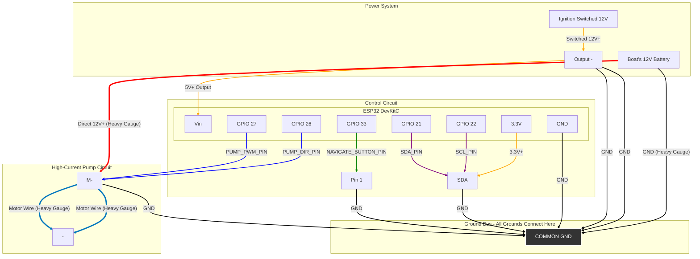

# ESP32 Self-Learning Boat Autopilot

This is a MicroPython project for a self-learning, adaptive autopilot for small to medium-sized boats with hydraulic steering. The system uses an ESP32 microcontroller and a BNO055 9-axis sensor to hold a steady course, continuously adapting to the boat's unique characteristics and sea conditions.

---

## Features

- **Self-Learning:** The autopilot requires no manual calibration. It learns the boat's steering characteristics while in use.
- **Adaptive PI Control:** Uses a PI controller that compensates for constant drift from sources like crosswind or currents.
- **Dual-Core Architecture:** Utilizes both cores of the ESP32 processor for maximum stability:
    - **Core 0:** Dedicated to fast and continuous reading of the compass sensor.
    - **Core 1:** Runs the main logic for navigation, learning, and motor control.
- **Permanent Memory:** Learned calibration data is stored permanently in the ESP32's Non-Volatile Storage (NVS).

---

## Recommended Hardware

- **Microcontroller:** ESP32 DevKitC (or a similar standard ESP32 board).
- **Sensor:** Adafruit BNO055 Absolute Orientation Sensor.
- **Motor Driver:** A powerful H-Bridge that can handle the pump's current draw (e.g., BTS7960 or Infineon BTN99xx).
- **Power Supply:** A 12V to 5V DC-DC Buck Converter to provide stable power to the electronics.
- **Pump:** A 12V reversible hydraulic pump (e.g., Raymarine Type 1).

---

## Circuit Diagram

This diagram shows the complete wiring. The control electronics are powered by a switched 12V source (like the boat's ignition), while the high-current pump motor is powered directly from the battery. A common ground connection between both circuits is **absolutely critical** for the system to function.

